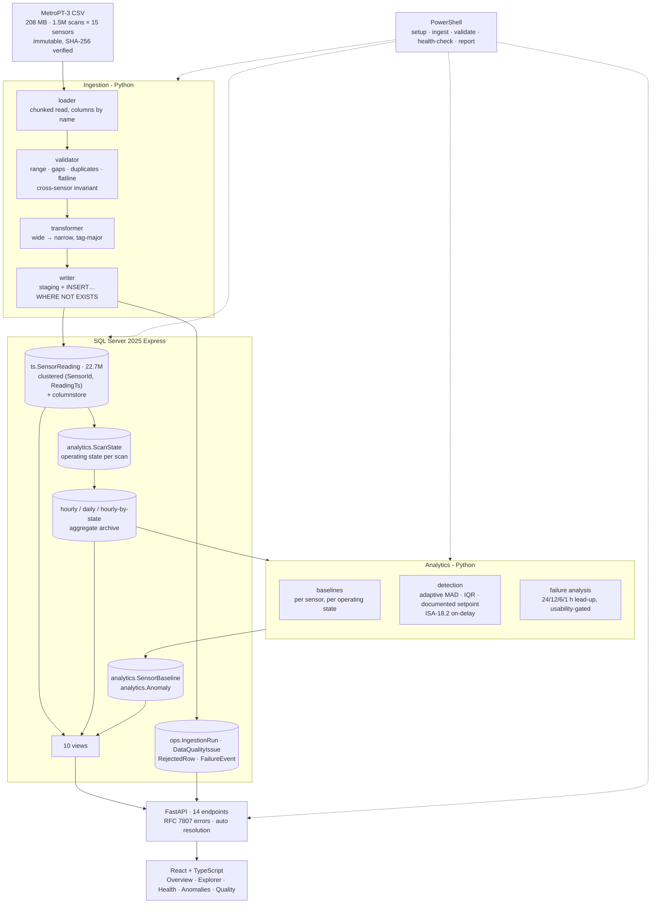
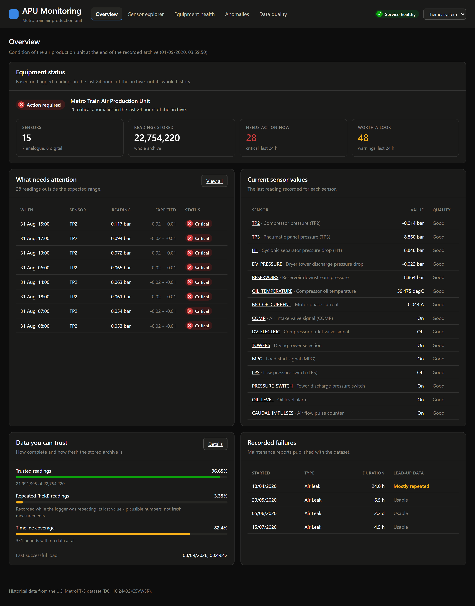
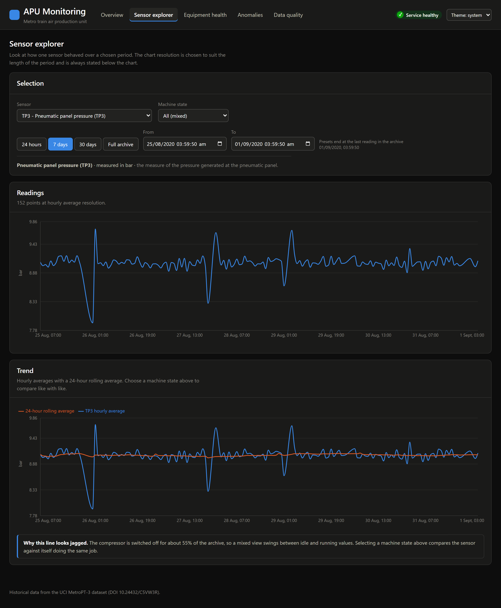
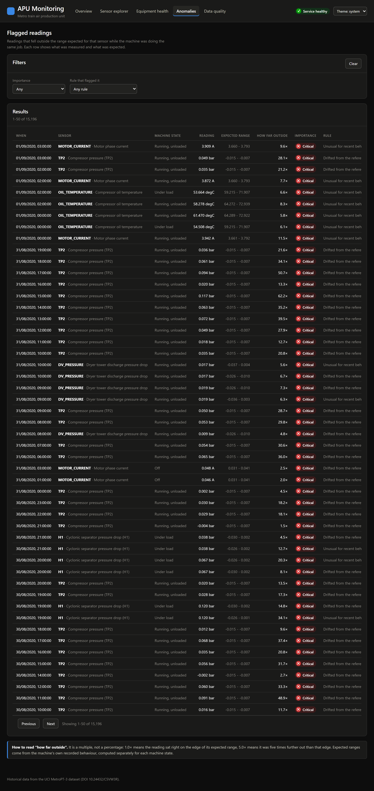
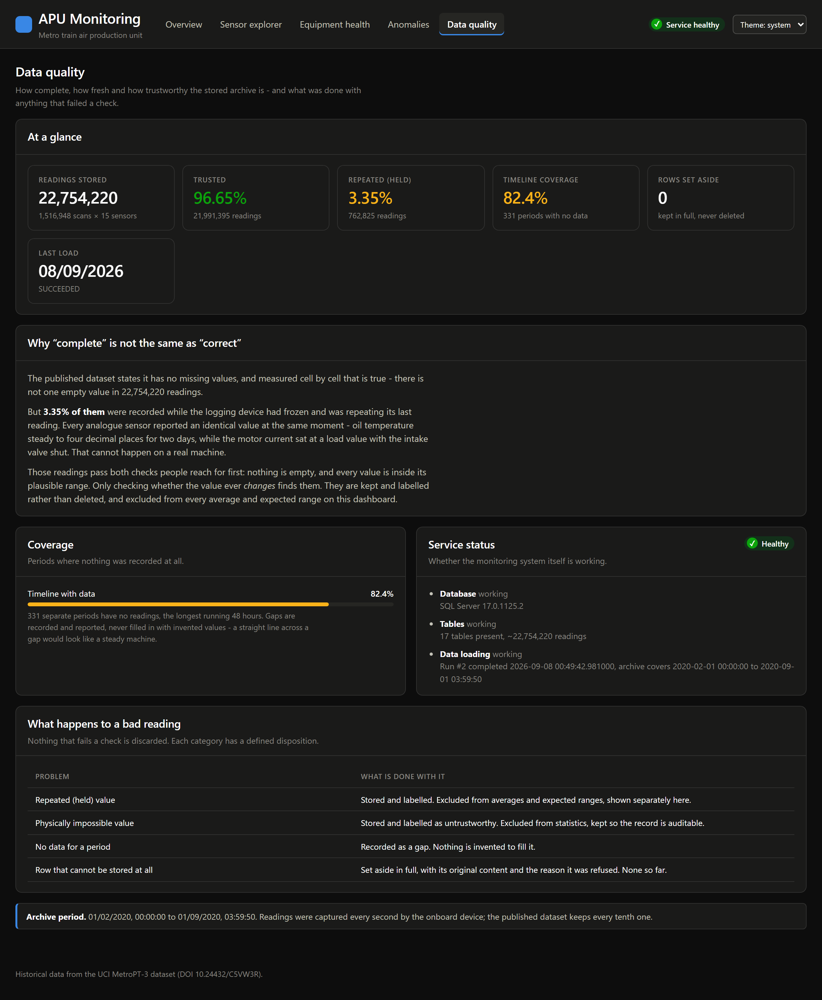

# Industrial Equipment Time-Series Monitoring Platform

An end-to-end condition-monitoring system for a metro train's compressor Air Production
Unit. 22.7 million sensor readings ingested, validated, stored in SQL Server, analysed,
served through a REST API, and presented to an operations engineer through a web
dashboard, with the routine work automated in PowerShell.

Built on the [UCI MetroPT-3 dataset](https://archive.ics.uci.edu/dataset/791/metropt+3+dataset)
(DOI `10.24432/C5VW3R`).

> A portfolio project applying industrial time-series monitoring concepts to a published
> research dataset.

---

## The problem

A compressor either runs or it does not, and by the time it does not, a train is
stationary. Condition monitoring is the practice of watching the machine's own signals,
pressures, temperatures and motor current, closely enough to notice a change before it
becomes a failure.

That is easy to describe and awkward to do, for three reasons this project ran into rather
than read about.

The archive is not the machine. 3.35% of this dataset is a logging device repeating its
last reading. Those values are non-null and inside their plausible range, so a null check
and a range check both pass them. They are not measurements.

"Normal" is not a number. The compressor is switched off 55% of the time, so every
pressure signal is bimodal and a single average describes neither state.

A detector that finds everything finds nothing. A textbook outlier rule on this data
produces roughly 7,300 alarms a day, against published guidance of about 150.

The system is built around those three facts.

---

## What it does

| | |
|---|---|
| Stores history | 22,754,220 readings, tag-based schema, ~1 GB with page compression |
| Validates on the way in | Nothing is silently dropped: bad values are labelled, unusable rows are quarantined verbatim |
| Knows what it does not know | Every reading carries a quality code; gaps and held data are reported, never filled in |
| Finds abnormal behaviour | Adaptive detection against the machine's own recent behaviour, in the same operating state |
| Compresses like a historian | Swinging-door trending: 4.3× fewer readings with a verified error bound |
| Answers questions fast | 14 REST endpoints, p95 under 50 ms |
| Shows an operator the answer | Five-screen dashboard in plain language, no statistical jargon |
| Runs itself | Five PowerShell scripts with a tested exit-code contract |

---

## Architecture



Full detail, including the six numbered design decisions: [`docs/ARCHITECTURE.md`](docs/ARCHITECTURE.md).

---

## Technologies

Python 3.12 · SQL Server 2025 Express · FastAPI · React 19 + TypeScript · PowerShell 5.1 ·
pandas · NumPy · pyodbc · Pydantic v2 · Recharts · Vite · pytest · ruff · mypy · Jinja2 ·
statsmodels · GitHub Actions · Docker (optional)

---

## Results

| | |
|---|---|
| Readings ingested | 22,754,220 in 18.3 min (20,727/s) |
| Re-run, same file | 3 s, SHA-256 short-circuit |
| Re-run with `--force` | 0 rows inserted, all matched as present |
| Database size | 1,032 MB, about 10% of the Express cap |
| Alarm reduction | 7,286/day → 12.5/day (583×), within EEMUA 191 guidance |
| Anomaly enrichment before documented failures | 11.5× |
| Swinging-door compression at 0.1% of span | 10,618,636 → 2,444,738 readings (4.3×) |
| Compression error budget used | 0.9998-1.0000, tight and never exceeded |
| Interpolated retrieval | 111,692 discarded readings checked, 0 outside the bound |
| API p95 | `/summary` 30 ms · `/health` 10 ms · readings 9-17 ms |
| Tests | 242 (233 need no database) |
| Exit-code contract | 13/13 |

---

## Compressing like a historian

What separates a process historian from a table with timestamps in it is that it does not
store every reading, and still guarantees what it gives back.

[`analytics/compression.py`](analytics/compression.py) implements Swinging Door Trending:
keep a reading only when no straight line from the last archived point can cover it within
a stated deviation. `analytics.fn_ValueAt` then answers "what was this tag reading at
14:07:33" from the two archived points that bracket the request, whether or not anything
was stored at that instant.

```powershell
.venv\Scripts\python.exe scripts\run_compression.py --sweep   # the trade-off curve
```

| Deviation (% of span) | Readings kept | Ratio |
|---|---|---|
| 0.02% | 4,761,015 | 2.2× |
| 0.10% | 2,444,738 | 4.3× |
| 1.00% | 833,713 | 12.7× |

The spread between sensors is the interesting part. `DV_PRESSURE` compresses 24.6× because
it sits flat for most of its life, while `OIL_TEMPERATURE` manages only 2.0× because its
noise is comparable to the deadband. Compression ratio is a property of the signal, which
is the argument against a single global setting.

The bound is verified rather than asserted. Every run reconstructs the full series from
the retained points and reports the worst deviation, and the error budget used across all
seven analogue sensors is 0.9998-1.0000: the algorithm spends essentially its whole
allowance and never exceeds it. Taking 111,692 readings compression discarded and asking
`fn_ValueAt` for those exact instants gave a max error of 0.009518 against an allowance of
0.009572, with zero violations.

Two other historian behaviours came with it. A time-weighted mean alongside the simple one,
which differ by up to 50% on sparse buckets where uneven sampling has the most leverage.
And a refusal to interpolate across a gap: `fn_ValueAt` returns no row rather than a line
drawn through a period when nothing was recorded.

The discovery that the textbook algorithm does not actually hold its own bound is
[DEV_LOG DL-043](docs/DEV_LOG.md), and the full scorecard, including what a real historian
has that this does not, is [`docs/HISTORIAN_CONCEPTS.md`](docs/HISTORIAN_CONCEPTS.md).

---

## Screenshots

Placeholders, to be replaced with images. Both servers must be running (see
[Running locally](#running-locally)), then capture at 1280 px wide in dark theme and save
as PNG to `docs/screenshots/`.

| File to add | Page | What it should show |
|---|---|---|
| `docs/screenshots/overview.png` | `http://localhost:5173/` | Equipment status with its written reason, stat tiles, "What needs attention" table, data-quality bars |
| `docs/screenshots/sensor-explorer.png` | `/sensors?sensor=TP3` | Sensor and machine-state selectors, 7-day preset active, the readings chart |
| `docs/screenshots/anomalies.png` | `/anomalies` | Paginated table with plain-English machine states and the expected-range column |
| `docs/screenshots/data-quality.png` | `/quality` | The "complete is not the same as correct" panel and the disposition table |
| `docs/screenshots/quality-report.png` | `reports/data_quality_report.html` | The generated HTML report |
| `docs/screenshots/swagger.png` | `http://localhost:8000/docs` | The 14 endpoints grouped by tag |

<!--




-->

---

## Running locally

### Prerequisites

Python 3.12 · Node 20+ · SQL Server (any edition, including Express) · ODBC Driver 18 for
SQL Server.

Docker is not required. See [Docker](#docker) if you would rather run SQL Server that way.

### Setup

```powershell
git clone <your-repo-url>
cd industrial-timeseries-monitor

.\scripts\setup.ps1 -CheckOnly    # verify prerequisites, change nothing
.\scripts\setup.ps1               # venv, dependencies, .env, database
```

### Get the dataset

Not committed, because it is 208 MB. See [`data/README.md`](data/README.md) for the hashes
to verify against.

```bash
curl -L --retry 6 --retry-all-errors --retry-delay 5 \
     --speed-limit 1024 --speed-time 60 \
     -o data/raw/metropt3.zip \
     "https://archive.ics.uci.edu/static/public/791/metropt+3+dataset.zip"
```

The retry flags are not decoration. The endpoint sends no `Content-Length` and drops
connections mid-stream, and a truncated download still looks like a valid ZIP.

### Load and analyse

```powershell
.\scripts\ingest.ps1                              # ~18 min for the full archive
.venv\Scripts\python.exe scripts\run_analytics.py # ~3 min
.venv\Scripts\python.exe scripts\run_compression.py --deviation-pct 0.1 --store
.\scripts\validate.ps1                            # checks + HTML report
.\scripts\health-check.ps1                        # confirm everything works
```

In a hurry? `.\scripts\ingest.ps1 -LimitDays 7` loads a week in about a minute. The run is
recorded as `PARTIAL` so a subset can never be mistaken for a full load.

### Run the API and dashboard

```powershell
.venv\Scripts\python.exe -m api          # http://127.0.0.1:8000/docs
```

```powershell
npm --prefix dashboard install
npm --prefix dashboard run dev           # http://localhost:5173
```

### Docker

`docker-compose.yml` runs SQL Server in a container for anyone who does not have it
installed. Point `DB_SERVER` at `localhost,1433` in `.env` and continue from Setup.

One honest note: this project was developed against a natively installed SQL Server. The
compose file is provided for convenience and has not been exercised on this machine,
because Docker is not installed here.

---

## Testing

```powershell
.venv\Scripts\python.exe -m pytest tests\ -q                      # 242 tests
.venv\Scripts\python.exe -m pytest tests\ -q -m "not integration" # 233, no database
.venv\Scripts\python.exe -m pytest tests\ --cov=ingestion --cov=analytics --cov=api

.venv\Scripts\python.exe -m ruff check .
.venv\Scripts\python.exe -m mypy ingestion analytics api

.\scripts\Test-Automation.ps1                    # 13 exit-code cases
.venv\Scripts\python.exe scripts\run_queries.py  # every demonstration query, timed
.venv\Scripts\python.exe scripts\benchmark_api.py

npm --prefix dashboard run typecheck
npm --prefix dashboard run build
```

233 of the 242 tests need no database. The API depends on a repository seam, so a fake
substitutes for SQL Server and the entire HTTP surface, including status codes, error
shapes, pagination and resolution selection, is verified without any infrastructure. That
is what keeps CI on the free tier.

The tests aim at the paths that do not run in normal operation. The source file is clean
enough that the quarantine code never executed across two full loads, so it is proven
against a deliberately corrupted file that carries one of every defect the pipeline claims
to handle.

---

## Example SQL

All eleven live in [`database/queries/`](database/queries/) and are executed by
`scripts/run_queries.py`, so the timings in [`docs/SQL_DESIGN.md`](docs/SQL_DESIGN.md) are
measured rather than claimed.

Latest value per sensor, where the access path matters more than the result.

```sql
-- CROSS APPLY ... TOP 1: one backward index seek per sensor. 15 seeks, ~16 ms.
-- ROW_NUMBER() OVER (PARTITION BY SensorId ORDER BY ReadingTs DESC) returns the same
-- rows by ranking all 22.7 million to discard all but 15.
SELECT s.SensorCode, latest.ReadingTs, latest.Value, s.Unit, q.Code AS Quality
FROM asset.Sensor AS s
CROSS APPLY (
    SELECT TOP (1) r.ReadingTs, r.Value, r.QualityCodeId
    FROM ts.SensorReading AS r
    WHERE r.SensorId = s.SensorId
    ORDER BY r.ReadingTs DESC
) AS latest
INNER JOIN ref.QualityCode AS q ON q.QualityCodeId = latest.QualityCodeId
WHERE s.IsActive = 1
ORDER BY s.DisplayOrder;
```

Hourly aggregation that admits how much data it used.

```sql
-- A fully covered hour is 360 samples at the measured 10 s interval. This archive is
-- 82.4% covered, so an average without its sample count invites false confidence.
SELECT
    DATEADD(hour, DATEDIFF(hour, 0, r.ReadingTs), 0)   AS BucketStart,
    COUNT_BIG(*)                                        AS SampleCount,
    CAST(100.0 * COUNT_BIG(*) / 360.0 AS DECIMAL(5,1))  AS CoveragePct,
    CAST(AVG(CAST(r.Value AS FLOAT)) AS DECIMAL(10,3))  AS AvgValue,
    CAST(STDEV(CAST(r.Value AS FLOAT)) AS DECIMAL(10,4)) AS StdDev
FROM ts.SensorReading AS r
INNER JOIN asset.Sensor    AS s ON s.SensorId      = r.SensorId
INNER JOIN ref.QualityCode AS q ON q.QualityCodeId = r.QualityCodeId
WHERE s.SensorCode = 'OIL_TEMPERATURE'
  AND r.ReadingTs >= '2020-06-01' AND r.ReadingTs < '2020-06-08'
GROUP BY DATEADD(hour, DATEDIFF(hour, 0, r.ReadingTs), 0)
ORDER BY BucketStart;
```

Gap detection: 331 gaps, the largest 48 hours.

```sql
WITH scans AS (
    SELECT r.ReadingTs, LAG(r.ReadingTs) OVER (ORDER BY r.ReadingTs) AS PrevReadingTs
    FROM ts.SensorReading AS r
    WHERE r.SensorId = (SELECT SensorId FROM asset.Sensor WHERE SensorCode = 'TP3')
)
SELECT PrevReadingTs AS GapStart, ReadingTs AS GapEnd,
       DATEDIFF(second, PrevReadingTs, ReadingTs) AS GapSeconds
FROM scans
WHERE PrevReadingTs IS NOT NULL
  -- 30 s = 3x the measured 10 s modal interval. The archive shows 9/10/12/13 s steps
  -- from logger jitter, so an exact-interval test would report a million false gaps.
  AND DATEDIFF(second, PrevReadingTs, ReadingTs) > 30
ORDER BY GapSeconds DESC;
```

Pre-failure analysis that refuses to answer when it cannot.

```sql
-- 69.5% of failure event #1's 24-hour lead-up is held data from a frozen logger.
-- Averaging it would describe an instrumentation fault and present the result next to
-- three genuine measurements. The query returns NULL instead.
SELECT s.SourceReference, s.Hours,
       CAST(100.0 * s.UsableScans / NULLIF(s.TotalScans, 0) AS DECIMAL(5,1)) AS UsablePct,
       CASE WHEN 100.0 * s.UsableScans / NULLIF(s.TotalScans, 0) < 50
            THEN NULL ELSE CAST(s.UsableMean AS DECIMAL(10,4)) END AS LeadUpMean,
       CASE WHEN 100.0 * s.UsableScans / NULLIF(s.TotalScans, 0) < 50
            THEN 'INSUFFICIENT DATA' ELSE 'COMPARABLE' END AS Verdict
FROM stats AS s;   -- full query: database/queries/10_failure_correlation.sql
```

---

## Design decisions

Why SQL Server. Named in the target role, and it earns its place: window functions,
`APPLY`, columnstore indexes, page compression and `MERGE` all do real work here. Express
Edition's 10 GB cap shaped the storage design rather than obstructing it, and the full
archive uses about a tenth of it.

Why a narrow tag/value fact table. `(SensorId, ReadingTs, Value, QualityCodeId)` gives
22.7 million rows instead of 1.5 million wide ones. This is how tag-based historians model
data, and it is the whole point: adding a sensor is a row in `asset.Sensor`, not a schema
migration. The cost is stated honestly in [`docs/SQL_DESIGN.md`](docs/SQL_DESIGN.md) AD-1.

Why no surrogate `ReadingId`. On 22.7 million rows an 8-byte identity costs ~180 MB and
buys nothing: `(SensorId, ReadingTs)` is already unique, and it is the exact order every
query wants. A deliberate deviation from the original brief, recorded as AD-2.

Why Python. pandas makes chunked reading and vectorised validation of a 208 MB file
straightforward, and `fast_executemany` is the difference between an 18-minute load and an
overnight one.

Why FastAPI. Automatic OpenAPI is not a convenience here. It is the contract the
dashboard's TypeScript types are generated from, and CI fails if the two drift.

Why the endpoints are synchronous `def`. pyodbc blocks. FastAPI runs a sync endpoint in a
worker thread, so a slow query delays one request instead of stalling every other one.
Declaring them `async` would look more modern and be strictly worse.

Why baselines are per operating state. Because a global one is wrong, not merely
imprecise. Measured over the reference month, the 1.5×IQR fences for `TP2` across all
states land at -0.015…-0.007 bar while the sensor genuinely reaches 10.68 bar under load,
so the rule would flag every moment the machine runs. For `MOTOR_CURRENT` the same rule
gives a negative lower fence and flags nothing. Both failure modes, opposite directions,
same cause. [`docs/ANALYTICS_FINDINGS.md`](docs/ANALYTICS_FINDINGS.md) section 1.

Why thresholds live in the database. No alert limit is written into code. A limit is a row
in `analytics.SensorBaseline` computed from a named, documented window, so it can be
challenged, recomputed, or shown to somebody who disagrees with it.

---

## What the analysis actually found

Written up in full in [`docs/ANALYTICS_FINDINGS.md`](docs/ANALYTICS_FINDINGS.md),
including the results that did not work out.

3.35% of the archive is frozen data. All seven analogue signals held bit-identical values
simultaneously for up to 51 hours: motor current pinned at 5.575 A with the intake valve
shut, oil temperature steady to four decimal places for two days. The dataset correctly
declares `has_missing_values: no` and there is not one null. Completeness is not
correctness, and only a change-detection check finds it.

Naive detection produces 7,286 alarms a day. Two measured causes: normal behaviour drifts,
with oil temperature under load at 55 °C in February and 65-70 °C afterwards, and IQR
fences collapse on tightly-peaked signals, with `MOTOR_CURRENT` while off having a 0.01 A
fence against 0.0088 A of scatter. Adaptive comparison, robust statistics, hourly
evaluation and an ISA-18.2 on-delay bring that to 12.5 a day, a 583× reduction, with 11.5×
enrichment before the documented failures.

A finding I had to withdraw. Against the February baseline the compressor appeared to run
far more than normal before each failure, which is physically plausible for an air leak
and tempting to report. Checked against every rolling 24-hour window in the archive
instead, event #2 sits at the 64th percentile and event #3 at the 38th, below the median.
Only one of three usable events is unusual. The pattern came from anchoring on February,
which is itself an atypically quiet month. Reporting it as a predictor would have been
wrong.

---

## Limitations

Stated plainly, because a portfolio project that overstates itself is worse than one that
does less.

- This is not a process historian. No PI System, no IP.21, no Wonderware. It implements
  historian mechanisms on a general-purpose RDBMS, including tag modelling, OPC-style
  quality codes, a raw archive alongside an aggregate archive, swinging-door compression,
  interpolated retrieval and time-weighted aggregation, and measures each one. What it
  does not have is an asset framework, store-and-forward collectors, native OPC
  connectivity, retention tiering or high availability.
  [`docs/HISTORIAN_CONCEPTS.md`](docs/HISTORIAN_CONCEPTS.md) is the itemised scorecard,
  including everything in the "not" list.
- No live connection to anything. The data is a fixed 2020 archive. There is no OPC UA
  client, no MQTT subscriber, no streaming ingest. Time ranges anchor to the end of the
  archive rather than to the wall clock, because otherwise every default view is empty.
- One machine, one failure mode, four events, three of them usable. Nothing here
  generalises to other equipment or other faults, and no accuracy figure computed from
  three positives would mean anything. None is quoted.
- No operating context. No train schedule, ambient temperature or demand data, so a rise
  in duty cycle cannot be separated from a busier week.
- The reference baseline is atypical. February is at roughly the 12th percentile of
  machine activity. It is kept because it is the only substantial failure-free window, and
  the limitation is recorded rather than papered over.
- Association, not causation. The 11.5× enrichment says alarms and failures co-occur. It
  does not establish that those alarms would have been actionable in advance.
- Single-node, single-user. No authentication, no role-based access, no high availability,
  no retention policy enforcement.
- CI has not run on GitHub. The workflow's five jobs were each executed locally before
  being committed, but no remote exists yet, so no badge is claimed.

---

## Future improvements

- Connect a live source over OPC UA or MQTT, with the existing validation applied to the
  stream rather than to a file.
- Streaming ingest with a windowed detector, instead of batch loads.
- Integrate with a real historian and compare storage and retrieval behaviour against this
  implementation.
- Role-based access control and an audit trail on threshold changes.
- Deploy to Azure: SQL Database, Container Apps for the API, Static Web Apps for the
  dashboard.
- Alarm rationalisation to ISA-18.2, with priority assignment, shelving, and a
  suppression-on-shutdown rule.
- Extend detection to multivariate relationships beyond the single documented cross-sensor
  invariant.

---

## Documentation

| Document | What it covers |
|---|---|
| [`docs/ARCHITECTURE.md`](docs/ARCHITECTURE.md) | Layers, data flow, decisions AD-1…AD-6 |
| [`docs/DATA_DICTIONARY.md`](docs/DATA_DICTIONARY.md) | Every column, verbatim source descriptions, the failure table and its defects |
| [`docs/DATA_PROFILE.md`](docs/DATA_PROFILE.md) | Measured profile: sampling, gaps, ranges, frozen blocks |
| [`docs/SQL_DESIGN.md`](docs/SQL_DESIGN.md) | Schema, indexes, views, the eleven queries, and the measurement behind every threshold |
| [`docs/ANALYTICS_FINDINGS.md`](docs/ANALYTICS_FINDINGS.md) | What the analysis found, including what failed |
| [`docs/HISTORIAN_CONCEPTS.md`](docs/HISTORIAN_CONCEPTS.md) | Which historian properties are implemented and measured, and which are not |
| [`docs/OPERATIONS.md`](docs/OPERATIONS.md) | Runbook: exit codes, troubleshooting, scheduling, recovery |
| [`docs/DEV_LOG.md`](docs/DEV_LOG.md) | 46 entries, every real error hit while building this, with root cause and fix |
| [`docs/IMPLEMENTATION_PLAN.md`](docs/IMPLEMENTATION_PLAN.md) | The nine phases and their measured exit criteria |

`docs/DEV_LOG.md` is the one worth reading. It records what actually broke: a memory-grant
stall that looked like a hang, a case-insensitive filesystem deleting a stylesheet, a view
that could never return a row, a lint fix that introduced a render loop. The recovery is
usually the interesting part.

---

## Dataset citation

```bibtex
@article{veloso2022metropt,
  title={The MetroPT dataset for predictive maintenance},
  author={Veloso, Bruno and Ribeiro, Rita P and Gama, Jo{\~a}o and Pereira, Pedro Mota},
  journal={Scientific Data}, volume={9}, number={1}, pages={764}, year={2022},
  publisher={Nature Publishing Group UK London}
}

@inproceedings{davari2021predictive,
  title={Predictive maintenance based on anomaly detection using deep learning for air
         production unit in the railway industry},
  author={Davari, Narjes and Veloso, Bruno and Ribeiro, Rita P and Pereira, Pedro Mota
          and Gama, Jo{\~a}o},
  booktitle={2021 IEEE 8th International Conference on Data Science and Advanced
             Analytics (DSAA)},
  pages={1--10}, year={2021}, organization={IEEE}
}
```

The dataset is redistributed by UCI under its own terms and is not included in this
repository.
