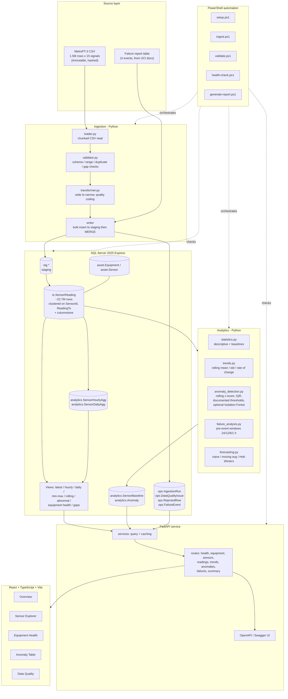
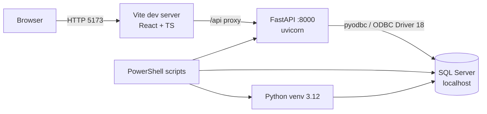

# Architecture

## 1. What this system is

An industrial time-series monitoring platform. It ingests historical condition-monitoring
data from a compressor Air Production Unit (APU), stores it in SQL Server in a queryable
time-series model, validates its quality, detects abnormal behaviour with interpretable
rules, and presents it to an operations engineer through a REST API and a web dashboard.
Routine operations are automated with PowerShell.

What it is not: a commercial process historian (PI System, Aspen IP.21, Wonderware,
Canary). It does not connect to live plant equipment. It applies the same concepts those
systems use - tag-based data modelling, quality codes, aggregate archives, time-window
retrieval - on top of a general-purpose RDBMS, using a published research dataset. See
"Limitations" in the README.

## 2. Design principles

| Principle | How it shows up here |
|---|---|
| Raw data is immutable | The source CSV is never edited. Cleaning produces new artefacts; the raw layer is preserved with a SHA-256 hash recorded per ingestion run. |
| Nothing is silently dropped | Rejected rows go to a quarantine table with a reason code. Every quality issue is recorded, counted and reported. |
| Thresholds must be justified | Every limit traces to either the dataset's own documentation (the 8.2 bar MPG setpoint, for instance) or to a statistic computed from an explicitly named baseline window. No magic numbers. |
| Idempotent pipelines | Re-running ingestion on the same file does not duplicate data. Enforced by a natural key plus a run ledger. |
| Config, not constants | Paths, connection strings and tuning parameters come from environment variables. No absolute paths, no credentials in source. |
| Observable by default | Structured logging, run ledger, health-check endpoint, and a PowerShell health script with real exit codes. |

## 3. System diagram

## 4. Layered data model

Medallion-style, with industrial framing.

| Layer | Location | Contents | Mutability |
|---|---|---|---|
| Raw | `data/raw/` | Original CSV + SHA-256 + download manifest | Immutable |
| Staging | `stg.SensorReadingStage` | Typed, parsed, per-run; truncated between runs | Transient |
| Curated | `ts.SensorReading`, `asset.*`, `ops.FailureEvent` | Validated narrow time series with quality codes | Append / MERGE |
| Aggregate | `analytics.SensorHourlyAgg`, `SensorDailyAgg` | Pre-computed rollups, the "aggregate archive" pattern historians use | Recomputable |
| Derived | `analytics.Anomaly`, `analytics.SensorBaseline` | Detection results and their reference statistics | Recomputable |
| Quarantine | `ops.RejectedRow`, `ops.DataQualityIssue` | Anything that failed validation, with reason | Append |

Nothing in Curated is deleted by the pipeline. Corrections are additive.

## 5. Key architectural decisions

### AD-1 - Narrow (tag/value) reading table instead of a wide 15-column table

`ts.SensorReading(SensorId, ReadingTs, Value, QualityCodeId)`, roughly 22.7 M rows,
rather than one row per timestamp with 15 value columns.

This is how every tag-based historian models data, and it is the whole point of the
exercise: adding a sensor is a row in `asset.Sensor`, not a schema migration. It also
makes per-tag quality codes, per-tag gaps and per-tag retention natural.

The cost is real and worth stating. Wide storage would be ~1.5 M rows and faster for
"give me every signal at time T". The narrow model costs a pivot for that query and 15x
the row count. Mitigated by a 2-byte `SensorId`, `REAL` values, a clustered index in
tag-major order, page compression, and a nonclustered columnstore index for scans.
Estimated size 0.3-0.7 GB, well inside the 10 GB per-database cap on Express.

### AD-2 - No surrogate `ReadingId` identity column

The brief suggested `ReadingId`. On a 22.7 M-row table an 8-byte identity adds ~180 MB
and buys nothing: `(SensorId, ReadingTs)` is already a natural, unique, and useful key,
and it is the exact order every query wants. The clustered primary key is that pair. A
deliberate deviation from the brief, recorded here.

### AD-3 - Bulk-load to staging, then MERGE

Row-by-row `INSERT` of 22.7 M rows over ODBC would take hours. The pipeline writes chunks
into a staging table using `fast_executemany` / `BULK INSERT`, then performs a set-based
`MERGE` (or `INSERT ... WHERE NOT EXISTS`) into the curated table. That gives idempotency
and a realistic ETL pattern in one step.

### AD-4 - Materialised aggregates rather than indexed views

Hourly and daily rollups are written to real tables by a scheduled job, not computed live.
Scanning 22.7 M rows per dashboard load is unacceptable, and SQL Server indexed views
cannot contain the window functions we need. This mirrors the historian concept of an
aggregate archive alongside the raw archive.

### AD-5 - Quality codes modelled on OPC conventions

`ts.SensorReading.QualityCodeId` references `ref.QualityCode`, seeded with
Good / Uncertain / Bad-style codes in the spirit of OPC DA quality. Every reading carries
provenance about how much it should be trusted; a value that failed a range check is
stored and marked Bad, never deleted. This is the single most historian-like property of
the design.

### AD-6 - Local SQL Server, Docker optional

Docker is not installed on the target machine, but three SQL Server 2025 Express instances
are, and all are reachable with Windows authentication. The primary supported path is
therefore local SQL Server. A `docker-compose.yml` targeting
`mcr.microsoft.com/mssql/server` is provided as an alternative for reviewers who have
Docker but not SQL Server, and both paths are documented in the README.

## 6. Runtime topology (local)

## 7. Technology choices and why

| Layer | Choice | Reason |
|---|---|---|
| Storage | SQL Server 2025 Express | Named in the target role; already installed; strong window functions, columnstore, partitioning, and `MERGE` for idempotent loads. |
| Driver | `pyodbc` + ODBC Driver 18, via SQLAlchemy | `fast_executemany` gives the bulk-load throughput this dataset needs; SQLAlchemy keeps queries testable and connection strings out of code. |
| Pipeline | Python 3.12 + pandas + NumPy | Chunked CSV reading, vectorised validation. 3.12 rather than 3.14 for wheel availability across pyodbc, SciPy and statsmodels. |
| Validation | Pydantic v2 | Declarative config and API contracts; settings loaded from environment. |
| API | FastAPI | Automatic OpenAPI, native async, Pydantic response models, minimal ceremony. |
| Dashboard | React + TypeScript + Vite + Recharts | Type safety across the API boundary; Recharts handles brush/zoom and reference lines without a licence. |
| Automation | PowerShell 5.1 | The platform is Windows, the role asks for it, and scripts return real exit codes for CI. |
| Tests | pytest | Standard, and fixtures make DB-free unit tests straightforward. |
| CI | GitHub Actions | Free tier only: lint, test, build. No SQL Server required, because the repository layer is mocked. |

## 8. Non-goals

- Real-time streaming ingest (no OPC UA or MQTT connection).
- Multi-tenant or role-based access control.
- High availability, replication, or retention/archival policy enforcement.
- Beating published research benchmarks on this dataset.
